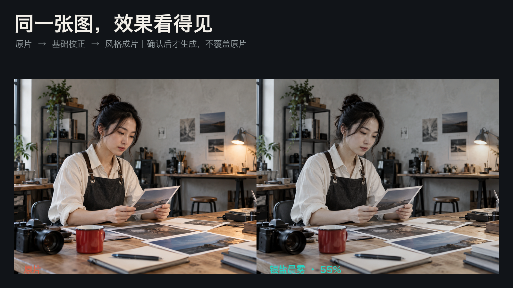
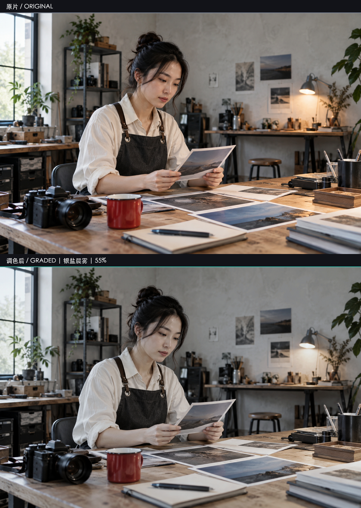

# BLCaptain Visual Director & Color Formula Skill v4.9.0

[中文](README.md) · [English](README.en.md) · [Latest Release](https://github.com/dososo/blcaptain-color-formula/releases/latest) · [Issues](https://github.com/dososo/blcaptain-color-formula/issues)



Give Codex a photo or standard SDR video. The Skill diagnoses the image, offers up to three safe directions, and renders only after you approve the current plan. It never overwrites the original.



> v4.9.0 is a public beta: 3 automatically recommended directions, 1 `manual-executable` direction available only by explicit request, and 28 research candidates. Catalog presence is not execution readiness, and technical checks are not aesthetic approval. See the [public beta scope](references/public-beta-scope.md).

## Why this Skill exists

Most filter packs apply a look first and leave you to decide whether it fits. BLCaptain moves the important judgment forward: it reads the image, explains directions and risks, then waits for approval of one exact plan. It is for people who want clear visual guidance, untouched originals, and reviewable results—not bulk preset browsing or a promise of Log/RAW, HDR, or parameter-identical cross-app matching in this release.

## Install

Verified: macOS, Python **3.9** or newer, and FFmpeg/ffprobe. Cold installation on Windows and Linux has not yet been verified.

### Release download (recommended)

1. Download `blcaptain-color-formula-4.9.0.zip` and its `.sha256` file from the [latest release](https://github.com/dososo/blcaptain-color-formula/releases/latest).
2. Unzip it, open the extracted folder, and run:

```bash
python3 scripts/install_skill.py
```

3. Restart Codex and say:

```text
Use BLCaptain Color Formula to grade this photo. Show me the directions first and render only after I approve the plan.
```

The default target is `~/.codex/skills/blcaptain-color-formula`. The installer refuses to overwrite an existing folder.

### Git clone

```bash
git clone https://github.com/dososo/blcaptain-color-formula.git ~/.codex/skills/blcaptain-color-formula
```

The core photo pipeline uses the Python standard library plus FFmpeg. Optional semantic features are listed in `requirements-optional.txt`; installing dependencies alone does not download model weights. Without a local model cache, the Skill falls back to the global pipeline.

## Your first photo

Attach a photo to Codex and say:

```text
Use BLCaptain Color Formula on this photo. Offer up to three suitable directions, wait for my approval, and do not overwrite the original.
```

The flow is: diagnosis → up to three directions and risks → one plan and `plan_id` → your approval → graded image, before/after comparison, and receipt. Refinements always restart from the original.

For terminal reproduction, run `suggest`, select a returned `status=executable` recipe ID, pass that exact ID to `plan`, then confirm only the current `plan_id`. Both `--strength 55` and `--strength 0.55` mean 55%.

## What makes it different

- Foundation before Look: exposure, white balance, black/white points, overall color, and texture are assessed first.
- Confirmation before rendering: a stale plan cannot authorize a new result.
- Reversible output: originals are not overwritten and adjustments are not repeatedly baked into old results.
- Separate gates: automated technical checks, Codex review, and human aesthetic acceptance remain distinct.
- Honest comparisons: demo sources need visible grading headroom and are never chosen merely to fit a style name.

## Current panorama

| Tier | Count | User access |
|---|---:|---|
| `active` | 3 | Can be recommended, subject to per-media checks |
| `manual-executable` | 1 | Only after an explicit user request |
| `research` | 28 | Cannot create a formal plan |

The Skill supports photos and standard SDR video where declared. Log/RAW, HDR, one-to-one cross-app reproduction, arbitrary semantic local edits, and full aesthetic approval of continuous video are not guaranteed in this release.

## Privacy, safety, and rights

The core pipeline reads media locally and writes to a user-selected output directory. There is no project account, telemetry, or project-operated upload server. Raw plans and receipts contain local paths and media hashes; redact them before sharing. The optional feedback ledger is local and can be cleared with `clear-feedback`.

You must have the right to process and publish your media. The MIT License covers this project's code and original documentation only; it does not replace licenses for FFmpeg, codecs, models, platforms, or user media. Read [PRIVACY.md](PRIVACY.md), [SECURITY.md](SECURITY.md), and [THIRD_PARTY_NOTICES.md](THIRD_PARTY_NOTICES.md).

## Verification

The Python 3.9+ core runtime contract is separate from the Python 3.10.18 full development-test contract. The v4.9.0 release is governed only by its tagged CI, package verification, and clean-install evidence. Full tests apply only to the development repository; the release package excludes tests, historical evidence, user media, workspaces, and Git metadata.

## Repository layout

```text
SKILL.md                 Skill entry point and operating rules
scripts/                 Installer, CLI, and package verification
references/              Public methods, scope, and source boundaries
agents/                  Codex display metadata
README.md / README.en.md  Chinese and English guides
```

The public repository contains only final files needed to run, understand, and verify the Skill. It excludes local paths, user media, drafts, caches, and internal acceptance records.

## FAQ

**Does it overwrite the original?** No. Results are written to a new output directory.

**Why confirm a `plan_id`?** It limits approval to the media, direction, strength, and local strategy you just reviewed.

**Does a technical pass mean the result looks good?** No. Technical checks, Codex review, and human aesthetic acceptance stay separate.

**Can it run offline?** The core photo pipeline can run locally. Network behavior of optional semantic backends depends on the implementation and models you choose to enable.

## Author and contact

- BLCaptain NEXT
- GitHub: [@dososo](https://github.com/dososo)
- X: [@thinkszyg](https://x.com/thinkszyg)
- Email: [blteam2026@outlook.com](mailto:blteam2026@outlook.com)
- Feedback: [GitHub Issues](https://github.com/dososo/blcaptain-color-formula/issues)

## License

[MIT](LICENSE) © BLCaptain. Third-party names are used only for factual identification and do not imply endorsement.
