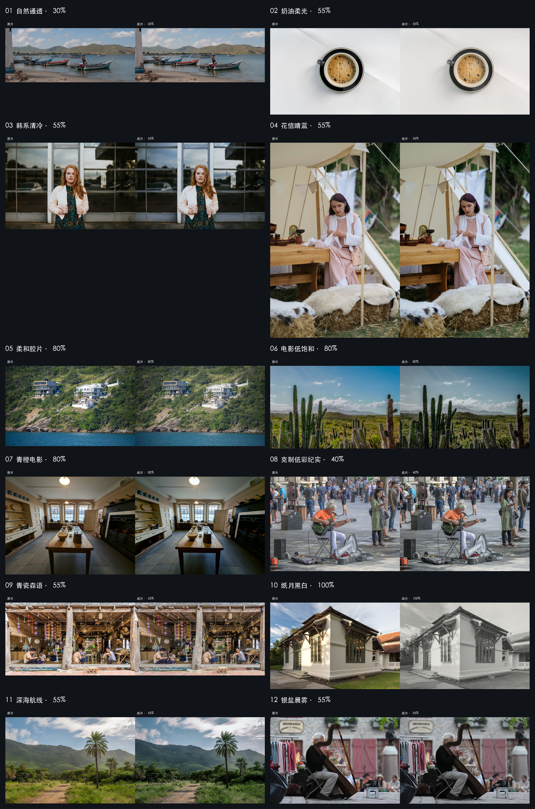

# BLCaptain 摄影视觉导演与调色公式 Skill v4.9.3

[中文](README.md) · [English](README.en.md)

[](https://github.com/dososo/blcaptain-color-formula/releases/latest) [](https://github.com/dososo/blcaptain-color-formula/actions/workflows/ci.yml) [](LICENSE)  

**一张照片、一段视频 → 看懂画面，选对色彩，确认后生成新成片。**

[立即下载](https://github.com/dososo/blcaptain-color-formula/releases/latest) · [三步开始](#安装) · [查看高清实测对比](showcase/真实样例/README.md) · [完整公式目录](FORMULAS.md)


<sub>AI 生成宣传主视觉；不是调色前后实测。实际效果请看下方同源对比。</sub>

| 完整公式 | 照片 | 普通 SDR 视频 | 原片保护 |
| :---: | :---: | :---: | :---: |
| **32 个** | **31 个** | **31 个** | **不覆盖原图** |

## 80 秒看懂它

[观看／下载横版（16:9）](showcase/videos/blcaptain-color-formula-4.9.3-landscape.mp4) · [观看／下载竖版（9:16）](showcase/videos/blcaptain-color-formula-4.9.3-portrait.mp4)

真实同源照片与连续视频前后对比，接着介绍公式目录、结果保留与安装。使用流程明确标为示意，不冒充软件录屏。两版均为 80 秒、30 fps，包含贯穿全片的连续器乐与六处动作音效；无旁白。[素材与音乐署名](showcase/VIDEO_CREDITS_4.9.3.md)。

## 它是什么

把照片或普通 SDR 视频交给 Codex：它先看懂画面，最多推荐 3 个合适方向；你也可以从完整目录直接选择。确认当前 `plan_id` 后，它才在本地生成成片和前后对比。**不覆盖原图。**

这是给 Codex 使用的 Skill：既可以直接生成照片与视频调色结果，也可以指导你在常用编辑软件中手动调整。32 个公式包含 21 个通用方向与 11 个 BLCaptain 原创作者风格，照片 31 个、视频 31 个；声明支持的公式都可直接选择、计划和执行。

## 能帮你解决什么

| 你的需求 | BLCaptain 的做法 | 你会得到 |
| --- | --- | --- |
| 不知道这张图适合怎么调 | 先看曝光、白平衡、主体和情绪，再推荐最多 3 个方向 | 有理由的选择，减少盲试 |
| 想要风格，也想保住肤色和细节 | 先建立基础影调，再加入风格并检查肤色、黑白位 | 更可控的色彩变化 |
| 想明确看出调色前后的价值 | 从同一份原素材生成结果与前后对比 | 可并排审看的真实变化 |
| 不满意，希望继续调整 | 根据反馈从原片重新建立方案，等你确认 | 新结果与保留完整的原文件 |

适合摄影爱好者、旅行与人像创作者、短视频创作者，以及希望用自然语言完成调色的 Codex 用户。摄影新手可以直接描述感受；熟练用户可以指定公式、强度或索取手动调整步骤。

> 当前为公开测试版。每份素材都会独立检查是否适合所选方向；遇到肤色、黑白位或剪切风险时，会提示换方向或降低强度。支持范围见 [公开测试说明](references/public-beta-scope.md)。

## 安装

已验证环境：macOS、Python **3.9** 或更高版本、FFmpeg／ffprobe。Windows 与 Linux 尚未完成冷安装验收。

### 方法一：下载 Release（推荐）

1. 从 [Latest Release](https://github.com/dososo/blcaptain-color-formula/releases/latest) 下载 `blcaptain-color-formula-4.9.3.zip` 和对应 `.sha256`。
2. 解压 ZIP，在解压后的目录运行：

```bash
python3 scripts/install_skill.py
```

3. 重新打开 Codex，附上照片并发送：

```text
用 BLCaptain 调色公式实际处理这张照片。先给我最多 3 个适合它的方向，等我确认后再生成；不要覆盖原图。
```

默认安装到 `~/.codex/skills/blcaptain-color-formula`。若同名目录已存在，安装器会停止且不会覆盖；请先自行改名保留旧版本。

如果不熟悉终端，可直接把解压后的文件夹交给 Codex，说：“请先检查 Python 与 FFmpeg 环境，再运行这个目录里的安装器；如果已有旧版本，先告诉我。”安装完成后重新打开 Codex。

### 方法二：Git 克隆

```bash
git clone https://github.com/dososo/blcaptain-color-formula.git ~/.codex/skills/blcaptain-color-formula
```

核心照片链路只需 Python 标准库与 FFmpeg。可选语义能力见 `requirements-optional.txt`；**仅安装依赖不会下载模型**，没有本地模型缓存时自动降级到全局链路。

## 第一张照片

你会依次看到：画面诊断 → 最多 3 个推荐方向 → 当前方案和唯一 `plan_id` → 确认后生成成片、前后对比、色卡与回执。想指定风格时可直接说中文名或使用目录 ID；不满意时从原图重新调整，不在旧结果上反复叠加。

推荐项的 `executable` 只表示本次素材通过了同链路预演，不是审美签字。需要修改时运行 `refine`，它只生成新方向和新确认单，不覆盖原图；成片、对比、色卡与回执任一失败都会回滚整组。

<details>
<summary>展开终端操作：照片、视频与局部处理</summary>

## 新用户 Quick Start（照片）

```bash
# 1. 诊断并返回最多 3 个适合当前素材的方向，不生成成片
python3 scripts/blcaptain_color.py suggest --input /照片路径/photo.jpg --mode smart --count 3 --strength 55 --display-only

# 2. 从 suggest 或完整目录中选择真实风格 ID
python3 scripts/blcaptain_color.py plan --input /照片路径/photo.jpg --style 选择的风格ID --strength 55 --output-dir /输出目录 --plan-out /输出目录/plan.json

# 3. 只确认当前计划里的 plan_id
python3 scripts/blcaptain_color.py render --plan /输出目录/plan.json --confirm-plan 当前plan_id

# 4. 不满意时从原图建立新方向，不在旧结果上叠加
python3 scripts/blcaptain_color.py refine --input /照片路径/photo.jpg --current-style 选择的风格ID --feedback "肤色回退" --strength 0.55
```

`--strength 55` 与 `--strength 0.55` 都表示 55%。计划被素材安全门拒绝时，应换方向、降低强度或换更适合的原图，不能绕过保护门。

## 新用户 Quick Start（视频）

```bash
python3 scripts/blcaptain_color.py suggest --input /视频路径/video.mp4 --mode smart --count 3 --strength 55 --display-only
python3 scripts/blcaptain_color.py shots --input /视频路径/video.mp4
python3 scripts/blcaptain_color.py plan --input /视频路径/video.mp4 --style 选择的风格ID --strength 55 --shot-grade --confirm-shot-boundaries --output-dir /输出目录 --plan-out /输出目录/video-plan.json
python3 scripts/blcaptain_color.py render --plan /输出目录/video-plan.json --confirm-plan 当前plan_id
```

视频必须检查完整成片的连续画面与声音；短预览和静帧不能代替全片观看。

需要语义局部处理时，先用 `plan --detect-local` 只查看本素材的真实候选；确认类别、覆盖率和边缘风险后，渲染时再提供 `render --confirm-local <策略>`。没有这道确认，不执行局部蒙版。

</details>

## 完整全景：照片 31 个，视频 31 个

正式目录共 32 个公式。`french-warm` 法式暖调仅照片，`night-black-gold` 夜景黑金仅视频，其余 30 个同时支持两种媒体。

### 照片公式（31）

自然通透 `natural-clean` · 奶油柔光 `cream-soft` · 韩系清冷 `korean-cool` · 花信晴蓝 `japanese-airy` · 法式暖调 `french-warm` · 柔和胶片 `film-soft` · 森林青绿 `forest-cyan` · 日落暖金 `sunset-warm` · 电影低饱和 `cinematic-muted` · 青橙电影 `teal-orange` · 美食鲜亮 `food-vivid` · 风景清透 `landscape-crisp` · 冷调霓虹夜景 `night-cool-neon` · 暖调治愈 `warm-cozy` · 克制低彩纪实 `documentary-low-color` · 闪光CCD `flash-ccd` · 雨夜蓝绿 `rainy-blue-green` · 冷灰海水 `cool-gray-sea` · 蓝调时刻 `blue-hour` · 黑白纪实 `bw-documentary` · 深海航线 `captain-deep-sea` · 青瓷森语 `celadon-forest` · 银盐晨雾 `silver-morning-mist` · 纸月黑白 `paper-moon-bw` · 高原寂光 `plateau-sacred-light` · 琥珀余烬 `amber-afterglow` · 绛雪梦境 `vermilion-snow-dream` · 黑曜金界 `obsidian-gold-realm` · 雨墨霓虹 `rain-ink-neon` · 沙海静玫 `desert-silent-rose` · 鎏金城纪 `gilded-autumn-city`。



### 视频公式（31）

自然通透 `natural-clean` · 奶油柔光 `cream-soft` · 韩系清冷 `korean-cool` · 花信晴蓝 `japanese-airy` · 柔和胶片 `film-soft` · 森林青绿 `forest-cyan` · 日落暖金 `sunset-warm` · 电影低饱和 `cinematic-muted` · 青橙电影 `teal-orange` · 夜景黑金 `night-black-gold` · 美食鲜亮 `food-vivid` · 风景清透 `landscape-crisp` · 冷调霓虹夜景 `night-cool-neon` · 暖调治愈 `warm-cozy` · 克制低彩纪实 `documentary-low-color` · 闪光CCD `flash-ccd` · 雨夜蓝绿 `rainy-blue-green` · 冷灰海水 `cool-gray-sea` · 蓝调时刻 `blue-hour` · 黑白纪实 `bw-documentary` · 深海航线 `captain-deep-sea` · 青瓷森语 `celadon-forest` · 银盐晨雾 `silver-morning-mist` · 纸月黑白 `paper-moon-bw` · 高原寂光 `plateau-sacred-light` · 琥珀余烬 `amber-afterglow` · 绛雪梦境 `vermilion-snow-dream` · 黑曜金界 `obsidian-gold-realm` · 雨墨霓虹 `rain-ink-neon` · 沙海静玫 `desert-silent-rose` · 鎏金城纪 `gilded-autumn-city`。


[逐张打开新样例大图与素材许可](showcase/真实样例/README.md)。以上两张图已换为本轮独立选材、正式执行的真实样例，**不是全部 31＋31 个公式的新图谱**；实际收录数量与逐项说明见样例页。没有为放大差异而给原片洗灰，也没有用 AI 重绘替代成片。

完整公式数量不变；尚未满足展示标准的新版对比不凑数。视频使用同源同帧对比，部分原作品节选为完整画幅的短片段进行执行；静帧不能代替动态审片。[完整目录与历史对比资料](FORMULAS.md)单独保留，不代表本轮全部重新验收。

## 它和滤镜包有什么不同

- Foundation 在前：先检查曝光、白平衡、黑白位、综合色彩与质感，再进入 Creative Look。
- 确认后生成：旧 `plan_id` 不能授权新素材、新强度或新局部策略。
- 逐素材安全：完整目录都可选，但黑位、白位、肤色、记忆色、剪切与变化量不合格时会拒绝当前计划。
- 结果可回退：不覆盖原文件，修改永远从原素材重做。
- 三道结论分开：自动技术门、Codex 顶级调色审查、用户人工接受不互相冒充。
- 不靠名称选样：展示原图必须有真实改善空间，前后变化在缩略图中也应可辨。

## 媒体、隐私与权利边界

支持 sRGB／Display P3 照片与普通 SDR 视频。RAW、未识别 Log、HDR／PQ／HLG／Dolby Vision、跨软件逐参数等效和任意视频语义跟踪不在本版保证范围。

核心调色在本机读取素材并写入你指定的输出目录，没有项目账号、遥测或自建上传服务器。原始计划和回执包含本机路径与素材哈希，公开分享前应脱敏。反馈账本默认位于 `~/.blcaptain/feedback-ledger.json`，可用 `clear-feedback` 清除。

用户必须拥有输入素材的处理与公开展示权。MIT License 只覆盖本项目代码与原创文档，不替代 FFmpeg、编解码器、模型、平台或用户媒体许可。详见 [隐私说明](PRIVACY.md)、[安全策略](SECURITY.md)、[数据与来源边界](references/source-and-data.md) 与 [第三方说明](THIRD_PARTY_NOTICES.md)。

## 验证

Python 3.9+ 核心运行合同与 Python 3.10.18 完整开发测试合同分开。v4.9.3 Release 只以对应标签的 CI、安装包核验与冷安装记录为准。

```bash
python3 -m unittest tests.test_v491_all_formulas_executable tests.test_public_formula_atlas tests.test_skill_package tests.test_portable_startup
python3 scripts/build_skill_package.py audit --root . --public-assets
```

全量测试仅适用于完整开发仓库；Release Skill 包不包含 `tests/`、历史证据、用户媒体、开发工作区、图谱生成脚本或 Git 元数据。

## 常见问题

**会覆盖原图吗？** 不会，结果写入新目录。

**必须会写命令吗？** 不需要。安装后附上素材，用自然语言描述希望得到的感觉；终端命令供需要精确控制的用户展开查看。

**安装后 Codex 找不到它怎么办？** 重新打开 Codex，并明确说“使用 BLCaptain 调色公式”。仍不可用时，检查安装器报告的目标目录内是否有 `SKILL.md`。

**提示缺少 FFmpeg 或 Python 怎么办？** 请 Codex 检查 `python3 --version`、`ffmpeg -version` 与 `ffprobe -version`，根据当前系统补齐依赖后重试。不要把安装成功当作素材处理成功。

**32 个公式为什么有 62 个入口？** 30 个公式同时支持照片与视频；法式暖调仅照片，夜景黑金仅视频，因此两类各有 31 个。

**为什么全部可执行还会拒绝某张素材？** 公式可执行说明入口真实存在；拒绝只说明当前原图在该方向或强度下会伤害黑白位、肤色、记忆色或变化边界。

**技术通过就代表好看吗？** 不代表。技术门、Codex 审片和用户接受始终分开。

**能离线使用吗？** 核心照片链路可在本地运行；可选语义后端是否联网取决于你自行启用的实现与模型。

## 贡献与联系

- 作者：爆裂队长 NEXT（BLCaptain）
- GitHub：[@dososo](https://github.com/dososo)
- X：[@thinkszyg](https://x.com/thinkszyg)
- 邮箱：[blteam2026@outlook.com](mailto:blteam2026@outlook.com)
- 问题与建议：[GitHub Issues](https://github.com/dososo/blcaptain-color-formula/issues)

提交改动前请先读 [CONTRIBUTING.md](CONTRIBUTING.md)。安全问题请按 [SECURITY.md](SECURITY.md) 私下报告。

## License

[MIT](LICENSE) © BLCaptain。第三方名称只用于事实性识别，不表示合作、授权或背书。
