# 新原片高清实测对比

本轮收录照片 **12** 项、视频 **6** 项。配方目录仍为照片31个、视频31个；本页不是62项新版图谱全部完成的声明。

每个风格在同类样例中使用不同作品；前后来自同一原片，保留完整画幅，不给原片人为洗灰、不用生成图替代真实调色。点击图片打开2400像素宽对比。视频为同帧静态比较，部分使用真实原作品的完整画幅短片段，技术检查覆盖实际执行片段的全部帧。

以下结果具有正式方案与执行回执；技术通过不等于用户审美接受。自然方向的变化较克制，电影低饱和强调环境退彩，纸月黑白强调柔灰层次；不是所有照片都追求同一种强对比。每项简介描述配方意图，不等于该次执行已使用语义分割或逐帧人物跟踪。

## 素材权利

每项标明原作品、作者与许可。展示为本项目实际处理的对比分析，不提供库存原片打包下载；第三方素材不适用项目代码的MIT许可。CC BY-SA素材的改编图按相应同许可条款提供，作者署名见对应项。

## 照片（12）

### 自然通透 · 30%

先纠正曝光与中性色偏，只恢复原片本来应有的层次和颜色，不主动添加风格。

[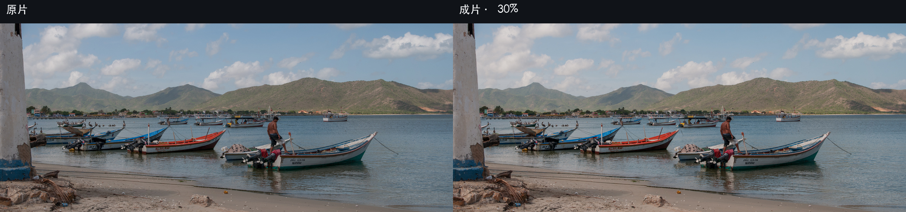](photo/natural-clean.jpg)

原作品：[港湾中的船、城镇与远山](https://commons.wikimedia.org/wiki/File:Panoramic_of_Juan_Griego.jpg) · 作者：Wilfredor · 许可：[CC0](http://creativecommons.org/publicdomain/zero/1.0/deed.en)。处理：BLCaptain调色Skill。

### 奶油柔光 · 55%

Foundation 之后只在未剪切的低彩高光肩部注入轻微奶黄；阴影、中间调与记忆色保持中性。

[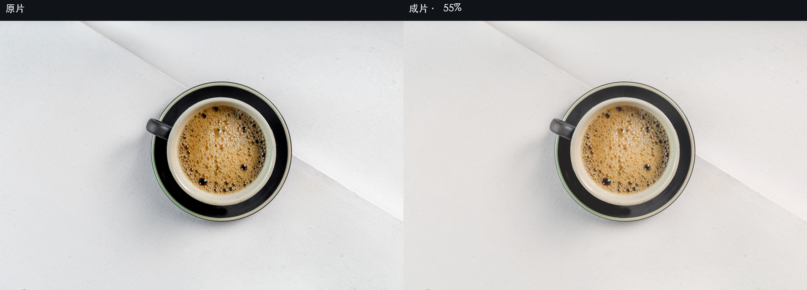](photo/cream-soft.jpg)

原作品：[白织物上的黑釉咖啡杯](https://commons.wikimedia.org/wiki/File:Espresso_Coffee_01.jpg) · 作者：Jubair1985 · 许可：[CC0](http://creativecommons.org/publicdomain/zero/1.0/deed.en)。处理：BLCaptain调色Skill。

### 韩系清冷 · 55%

从已校正 Foundation 出发，只冷化人物与近中性白位保护区以外的环境，让主体保留体温。

[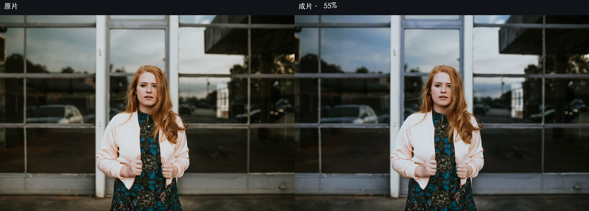](photo/korean-cool.jpg)

原作品：[玻璃前穿白外套的红发女性](https://commons.wikimedia.org/wiki/File:Woman_in_front_of_window_(Unsplash).jpg) · 作者：Brooke Cagle brookecagle · 许可：[CC0](http://creativecommons.org/publicdomain/zero/1.0/deed.en)。处理：BLCaptain调色Skill。

### 花信晴蓝 · 55%

用粉蓝冷白建立清洁空气，以自然暖肤、柠檬黄和少量玫红形成生命色锚点。

[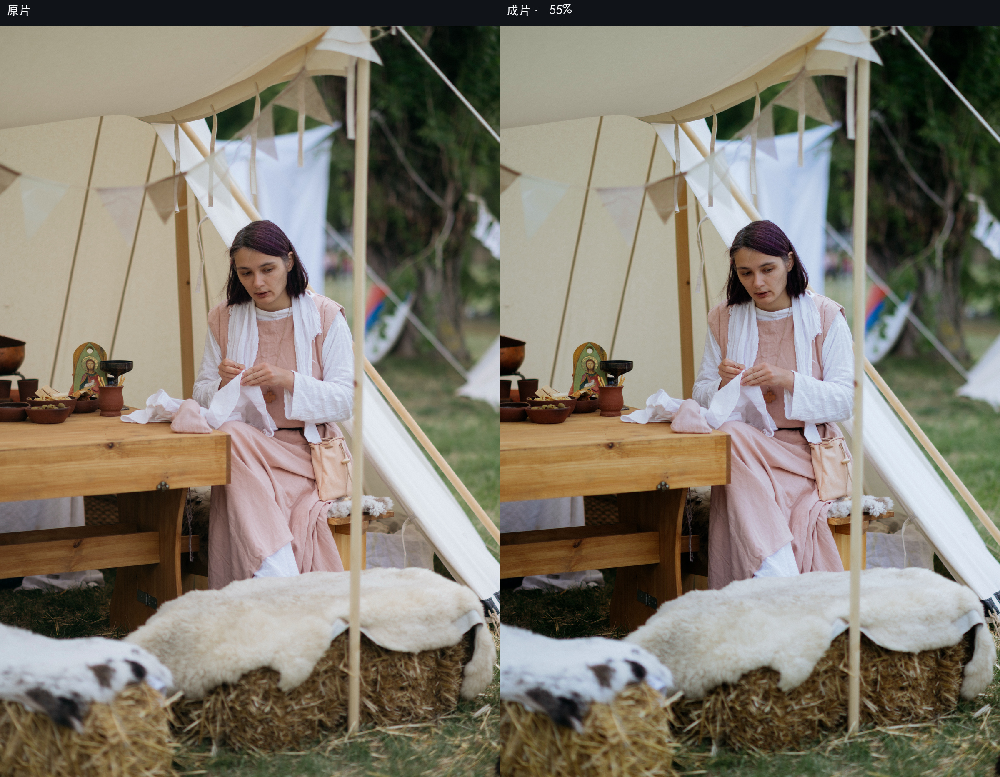](photo/japanese-airy.jpg)

原作品：[帐篷下缝纫的人与白布](https://commons.wikimedia.org/wiki/File:Woman_sewing_at_craft_event_in_outdoor_tent_setting.jpg) · 作者：Shixart1985 · 许可：[CC BY 2.0](https://creativecommons.org/licenses/by/2.0)。处理：BLCaptain调色Skill。

### 柔和胶片 · 80%

先完成中性一级校正，再以琥珀暗部趾部、中性高光肩部、记忆色保留与亮度调制颗粒建立柔和胶片感。

[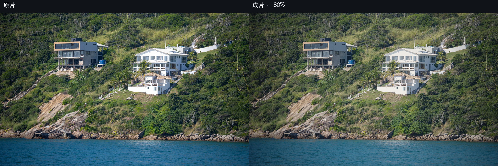](photo/film-soft.jpg)

原作品：[海岸岩面、白建筑与绿色植被](https://commons.wikimedia.org/wiki/File:Coastal_landscape_in_Arraial_do_Cabo,_Rio_de_Janeiro_state,_Brazil.jpg) · 作者：Wilfredor · 许可：[CC0](http://creativecommons.org/publicdomain/zero/1.0/deed.en)。处理：BLCaptain调色Skill。

### 电影低饱和 · 80%

从已校正 Foundation 出发，收窄非暖色环境的色彩宽度并建立趾肩密度，保留人物与记忆色。

[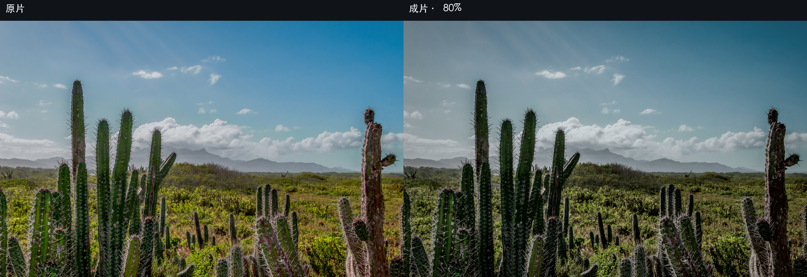](photo/cinematic-muted.jpg)

原作品：[自然日光中的植被土壤与天空](https://commons.wikimedia.org/wiki/File:Stenocereus_heptagonus_from_Macanao_Peninsula.jpg) · 作者：Wilfredor · 许可：[CC0](http://creativecommons.org/publicdomain/zero/1.0/deed.en)。处理：BLCaptain调色Skill。

### 青橙电影 · 80%

冷暗部与暖亮部的近似全局实现；有人像时需人工检查肤色。

[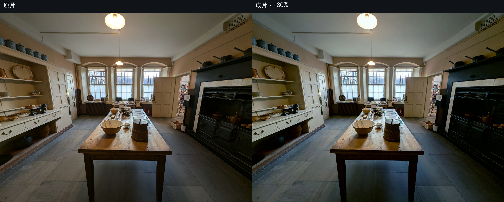](photo/teal-orange.jpg)

原作品：[厨房中的木桌、黑炉与白门窗](https://commons.wikimedia.org/wiki/File:Standen_House_kitchen_2024-10-08.jpg) · 作者：Andy Li · 许可：[CC0](http://creativecommons.org/publicdomain/zero/1.0/deed.en)。处理：BLCaptain调色Skill。

### 克制低彩纪实 · 40%

压低综合色彩，以冷静阴影和克制高光保留事件与空间结构。

[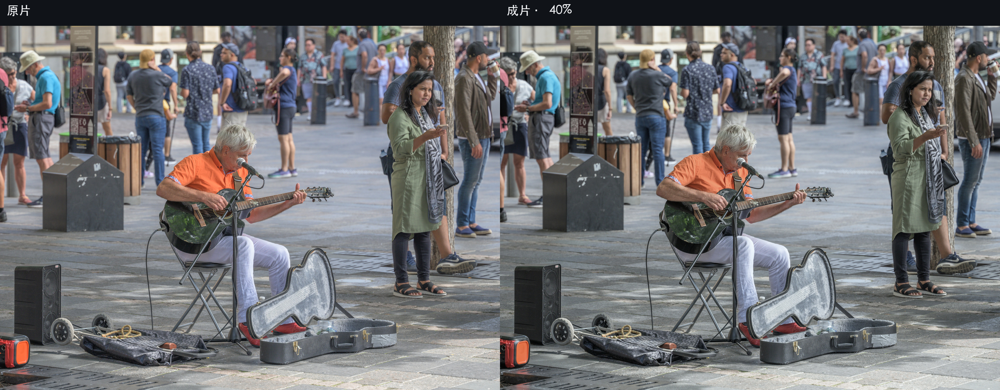](photo/documentary-low-color.jpg)

原作品：[广场上的街头音乐演奏者](https://commons.wikimedia.org/wiki/File:Street_photography_in_Montreal_001.jpg) · 作者：Wilfredor · 许可：[CC0](http://creativecommons.org/publicdomain/zero/1.0/deed.en)。处理：BLCaptain调色Skill。

### 青瓷森语 · 55%

将黄绿收敛为温润青瓷绿，并以微暖釉色高光保持东方空气感。

[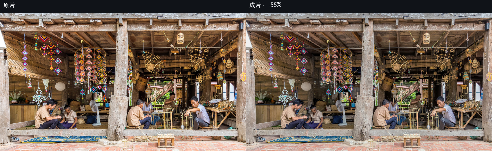](photo/celadon-forest.jpg)

原作品：[竹编工坊的劳动者与竹木材料](https://commons.wikimedia.org/wiki/File:Craftmen_at_work,_bamboo_basket_weaving_and_textile_mobile_sculptures,_in_Heuan_Chan_heritage_house,_Luang_Prabang,_Laos.jpg) · 作者：Basile Morin · 许可：[CC BY-SA 4.0](https://creativecommons.org/licenses/by-sa/4.0/)。处理：BLCaptain调色Skill。

### 纸月黑白 · 100%

以纸白高光、石墨灰影调和柔颗粒形成安静的情绪黑白。

[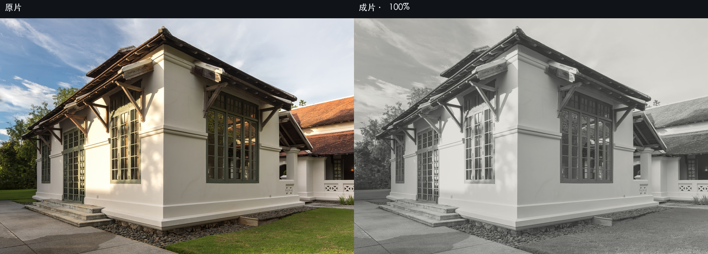](photo/paper-moon-bw.jpg)

原作品：[斜射光中的木窗白墙建筑](https://commons.wikimedia.org/wiki/File:Library_of_Amantaka_luxury_Resort_%26_Hotel_in_Luang_Prabang_Laos.jpg) · 作者：Basile Morin · 许可：[CC BY-SA 4.0](https://creativecommons.org/licenses/by-sa/4.0)。处理：BLCaptain调色Skill。

审片说明：此例偏柔灰黑白，不等同于强墨黑或高反差黑白。

### 深海航线 · 55%

以深海蓝暗部、象牙高光和克制暖色构成BLCaptain核心视觉。

[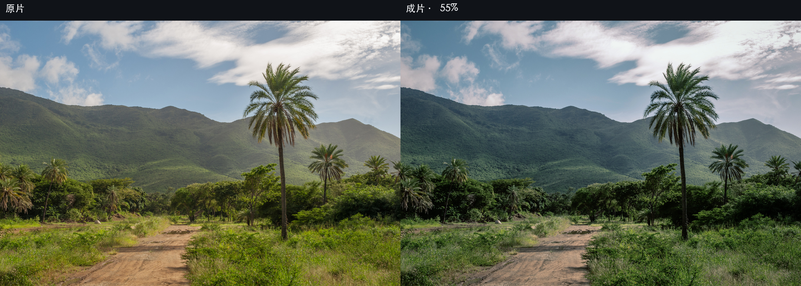](photo/captain-deep-sea.jpg)

原作品：[日光下的山谷土路、绿树与远山](https://commons.wikimedia.org/wiki/File:San_Juan_Valley.jpg) · 作者：Wilfredor · 许可：[CC0](http://creativecommons.org/publicdomain/zero/1.0/deed.en)。处理：BLCaptain调色Skill。

### 银盐晨雾 · 55%

以银灰低彩、柔和趾肩和细颗粒形成安静晨雾气质。

[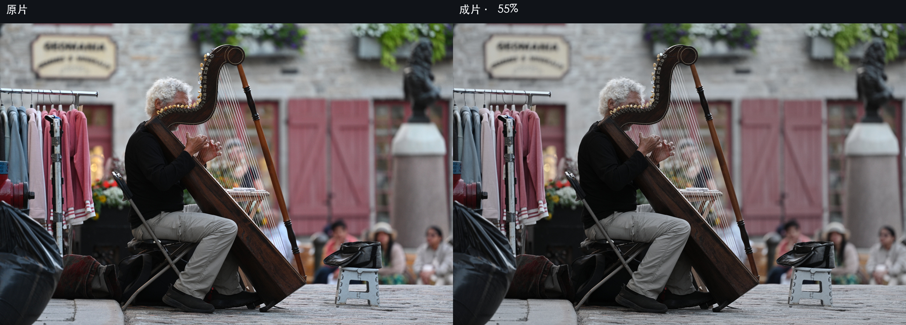](photo/silver-morning-mist.jpg)

原作品：[街头竖琴师与弦列](https://commons.wikimedia.org/wiki/File:Harpist_playing_in_the_street,_Quebec_City.jpg) · 作者：Wilfredor · 许可：[CC0 1.0](https://creativecommons.org/publicdomain/zero/1.0/)。处理：BLCaptain调色Skill。

## 视频（6）

### 电影低饱和 · 55%

从已校正 Foundation 出发，收窄非暖色环境的色彩宽度并建立趾肩密度，保留人物与记忆色。

[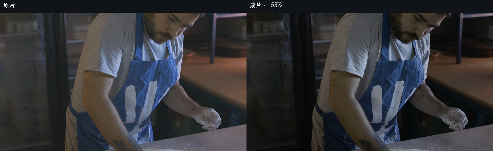](video/cinematic-muted.jpg)

原作品：[面包师在桌上准备面粉](https://mixkit.co/free-stock-video/baker-preparing-the-flour-on-a-table-42463/) · 作者：Mixkit · 许可：[Mixkit Stock Video Free License](https://mixkit.co/license/#videoFree)。处理：BLCaptain调色Skill。

审片说明：本例人物也呈较低调密度，不作为自动人物保护的示范。

### 青橙电影 · 55%

冷暗部与暖亮部的近似全局实现；有人像时需人工检查肤色。

[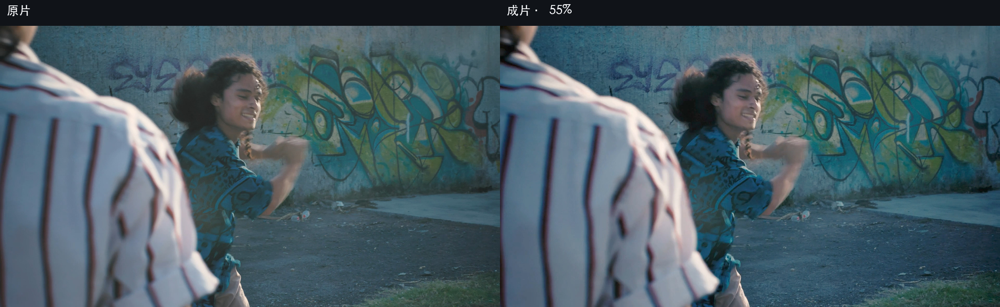](video/teal-orange.jpg)

原作品：[街头跳街舞的年轻人](https://mixkit.co/free-stock-video/young-people-dancing-hip-hop-on-the-street-3625/) · 作者：Mixkit · 许可：[Mixkit Stock Video Free License](https://mixkit.co/license/#videoFree)。处理：BLCaptain调色Skill。

### 雨夜蓝绿 · 55%

用冷蓝绿环境、压缩灯光和轻抬暗部表现湿地反射。

[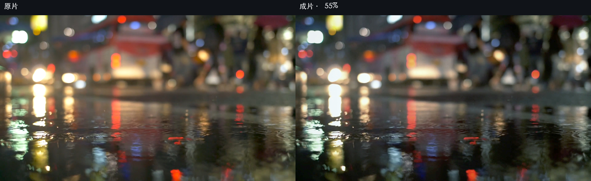](video/rainy-blue-green.jpg)

原作品：[雨中街道与刹车灯](https://pixabay.com/videos/rain-street-brake-lights-151426/) · 作者：Sayakulov · 许可：[Pixabay Content License](https://pixabay.com/service/license-summary/)。处理：BLCaptain调色Skill。

### 黑白纪实 · 65%

以深黑位、中高对比和稳定颗粒突出事件、轮廓与空间关系。

[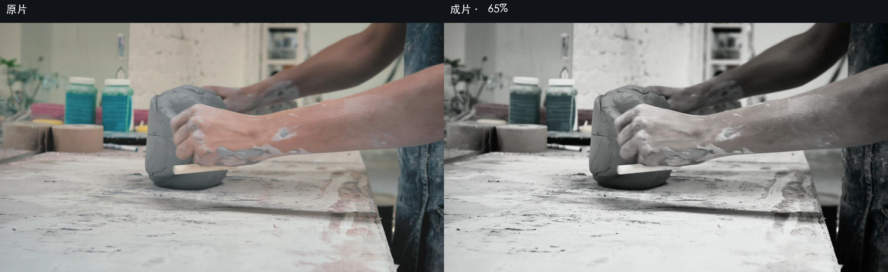](video/bw-documentary.jpg)

原作品：[陶艺师在工作室制作陶器](https://mixkit.co/free-stock-video/ceramic-artist-working-in-the-workshop-1971/) · 作者：Mixkit · 许可：[Mixkit Stock Video Free License](https://mixkit.co/license/#videoFree)。处理：BLCaptain调色Skill。

### 纸月黑白 · 70%

以纸白高光、石墨灰影调和柔颗粒形成安静的情绪黑白。

[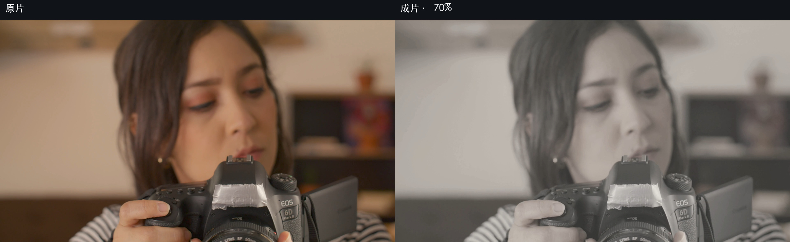](video/paper-moon-bw.jpg)

原作品：[拿相机拍照的年轻摄影师](https://mixkit.co/free-stock-video/portrait-of-a-woman-taking-a-photo-with-a-camera-44109/) · 作者：Mixkit · 许可：[Mixkit Stock Video Free License](https://mixkit.co/license/#videoFree)。处理：BLCaptain调色Skill。

审片说明：此例偏柔灰黑白，不等同于强墨黑或高反差黑白。

### 美食鲜亮 · 55%

在可靠美食题材证据下，把综合色彩集中给食物并让环境退让，同时保护白盘、黑位与肤色。

[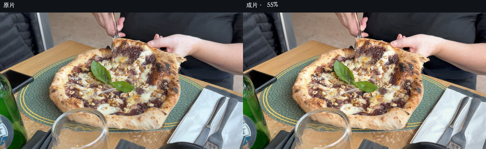](video/food-vivid.jpg)

原作品：[剪刀分切披萨](https://commons.wikimedia.org/wiki/File:Trento_Pizza_cut_with_scissors.webm) · 作者：Thilo Parg · 许可：[CC BY-SA 4.0](https://creativecommons.org/licenses/by-sa/4.0/)。处理：BLCaptain调色Skill。

## 查看完整目录

[视频逐项帧号与审片说明](视频逐项审看.md) · [美食视频详细许可](美食视频素材许可.md)

[全部公式与历史资料](../../FORMULAS.md) · [返回首页](../../README.md)
