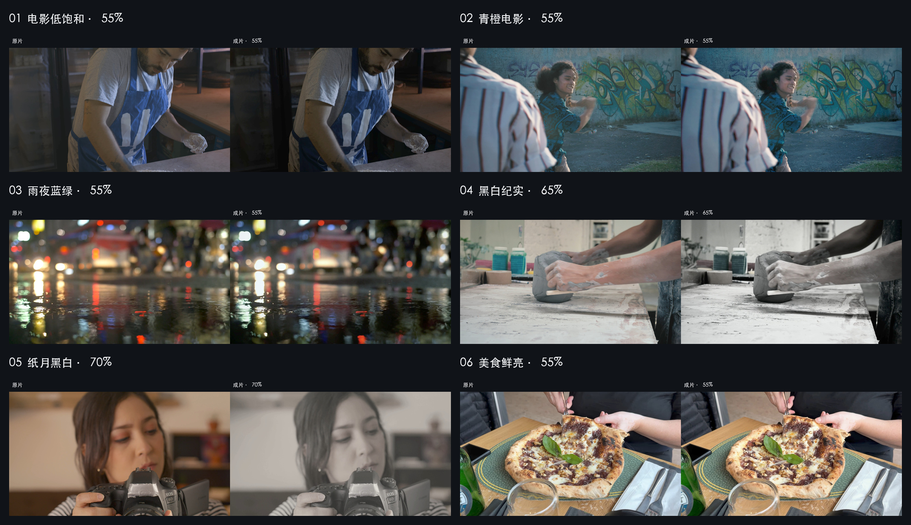

# 5 条真实视频调色样例

这是 5 条正式生成、已验证来源与方案/回执对应关系的视频样例，不是完整 31 项视频图谱。图中左右来自同一视频、同一帧号，等尺寸展示；原片未额外美化。技术校验通过但带有检查发现，不等于用户审美接受。

| 配方与强度 | 实际展示范围与帧号 | 本次快照观察 |
| --- | --- | --- |
| 电影低饱和 55% | 原片前 3 秒；第 36 帧 | 低彩密度更深，但人物脸部也明显更暗；仅作为低调效果示例，不宣称人物亮度或肤色自动保真。 |
| 青橙电影 55% | 完整 11.80 秒连续原片；第 212 帧 | 蓝衣与环境密度略增强，源本身已有青色环境，变化相对克制。 |
| 雨夜蓝绿 55% | 原片前 3 秒；第 37 帧 | 湿路面密度更深，杂色收敛，红色信号保留；不是整屏强蓝效果。 |
| 黑白纪实 65% | 完整 18.018 秒连续原片；第 323 帧 | 泥、手、布与白工作台具有可辨明度层次。 |
| 纸月黑白 70% | 原片前 3 秒；第 36 帧 | 柔灰黑白，镜头黑位较柔，不作为强墨黑示例。 |

上述观察来自最终联系表及同源三时点快照，不代表完整人工播放；全帧时序校验、技术安全门与用户审美接受是不同步骤。配方目录中的概述不构成本次已执行人脸、天空或商品语义保护的证明。

## 来源与许可

- 电影低饱和：[面包师在桌上准备面粉](https://mixkit.co/free-stock-video/baker-preparing-the-flour-on-a-table-42463/)，Mixkit，[Mixkit Stock Video Free License](https://mixkit.co/license/#videoFree)。
- 青橙电影：[街头跳街舞的年轻人](https://mixkit.co/free-stock-video/young-people-dancing-hip-hop-on-the-street-3625/)，Mixkit，[Mixkit Stock Video Free License](https://mixkit.co/license/#videoFree)。
- 雨夜蓝绿：[雨中街道与刹车灯](https://pixabay.com/videos/rain-street-brake-lights-151426/)，Sayakulov，[Pixabay Content License](https://pixabay.com/service/license-summary/)。
- 黑白纪实：[陶艺师在工作室制作陶器](https://mixkit.co/free-stock-video/ceramic-artist-working-in-the-workshop-1971/)，Mixkit，[Mixkit Stock Video Free License](https://mixkit.co/license/#videoFree)。
- 纸月黑白：[拿相机拍照的年轻摄影师](https://mixkit.co/free-stock-video/portrait-of-a-woman-taking-a-photo-with-a-camera-44109/)，Mixkit，[Mixkit Stock Video Free License](https://mixkit.co/license/#videoFree)。

公开内容仅包括带说明的前后对比图，不上传库存原视频或独立调色视频。原素材仍受各自许可与附加权利限制，不因仓库代码许可而改为 MIT；画面中的人物、作者与品牌不为本产品背书。
